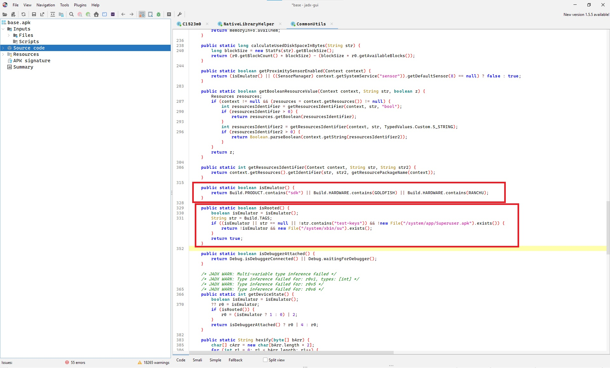
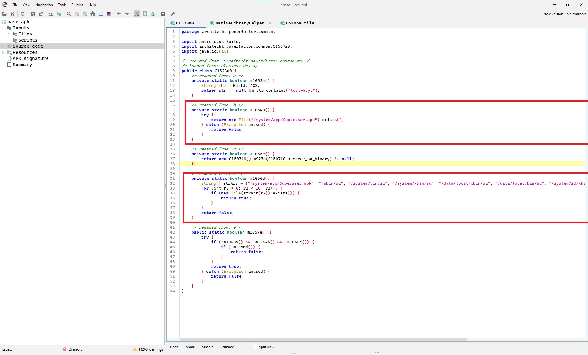
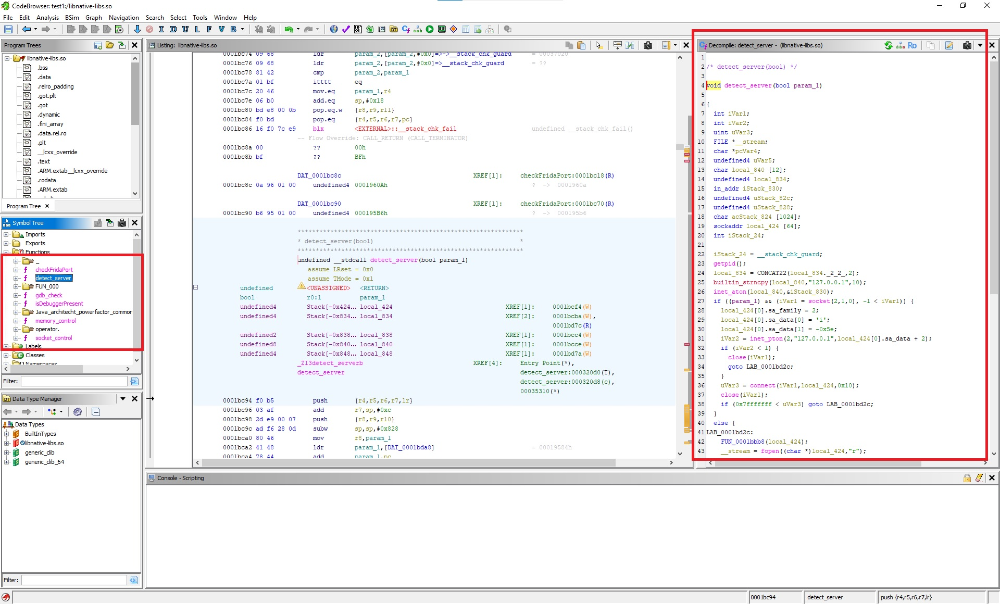
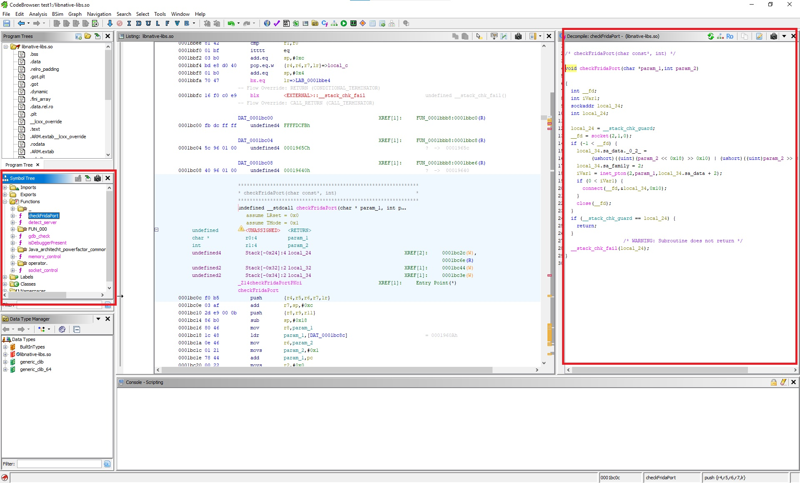

# Mobile App Traffic & Security Analysis Toolkit

<p align="center">
  <strong>A comprehensive guide and toolkit for mobile application security analysis</strong>
</p>

<p align="center">
  
  
  
  
</p>

This project provides an end-to-end walkthrough of mobile application security analysis — from intercepting network traffic and decompiling APKs, to reverse engineering native libraries and performing runtime instrumentation. Whether you are a penetration tester, security researcher, or developer hardening your own app, this guide covers the core techniques with real-world examples.

**Included Python tools** automate the most common tasks: extracting API endpoints from APK files, analyzing captured HTTP traffic, auditing permissions, scanning for hardcoded secrets, and detecting SSL pinning implementations.

> **Disclaimer:** This toolkit is intended for **authorized security testing, educational purposes, and legitimate security research only**. Always obtain proper authorization before analyzing any application you do not own. Unauthorized access to computer systems is illegal. The authors are not responsible for any misuse of this material.

---

## Table of Contents

- [Prerequisites & Setup](#prerequisites--setup)
  - [Required Tools](#required-tools)
  - [Environment Setup](#environment-setup)
  - [Android Device / Emulator](#android-device--emulator)
- [Traffic Interception](#traffic-interception)
  - [How It Works](#how-it-works)
  - [Setting Up mitmproxy](#setting-up-mitmproxy)
  - [Configuring Android Device](#configuring-android-device)
  - [Installing CA Certificate](#installing-ca-certificate)
  - [Capturing HTTPS Traffic](#capturing-https-traffic)
  - [Bypassing Certificate Pinning](#bypassing-certificate-pinning)
- [APK Analysis with JADX](#apk-analysis-with-jadx)
  - [Obtaining the APK](#obtaining-the-apk)
  - [Decompiling with JADX-GUI](#decompiling-with-jadx-gui)
  - [Navigating the Decompiled Code](#navigating-the-decompiled-code)
  - [What to Look For](#what-to-look-for)
  - [Real-World Example: Root & Emulator Detection](#real-world-example-root--emulator-detection)
- [Native Library Analysis (.so Files)](#native-library-analysis-so-files)
  - [Why Analyze Native Libraries?](#why-analyze-native-libraries)
  - [Extracting Native Libraries](#extracting-native-libraries)
  - [Analysis with Ghidra](#analysis-with-ghidra)
  - [Analysis with IDA Pro](#analysis-with-ida-pro)
  - [Real-World Example: Ghidra in Action](#real-world-example-ghidra-in-action)
  - [Key Techniques](#key-techniques)
- [Dynamic Analysis with Frida](#dynamic-analysis-with-frida)
  - [What is Frida?](#what-is-frida)
  - [Setting Up Frida](#setting-up-frida)
  - [SSL Pinning Bypass](#ssl-pinning-bypass)
  - [Root Detection Bypass](#root-detection-bypass)
  - [Hooking Java Methods](#hooking-java-methods)
  - [Hooking Native Functions](#hooking-native-functions)
  - [API Call Monitoring](#api-call-monitoring)
  - [Anti-Frida Protections](#anti-frida-protections)
- [Included Tools](#included-tools)
  - [APK Endpoint Extractor](#apk-endpoint-extractor)
  - [Traffic Analyzer](#traffic-analyzer)
  - [APK Permission Auditor](#apk-permission-auditor)
  - [Secret Scanner](#secret-scanner)
  - [SSL Pinning Checker](#ssl-pinning-checker)
- [Typical Analysis Workflow](#typical-analysis-workflow)
- [Resources & References](#resources--references)
- [License](#license)

---

## Prerequisites & Setup

### Required Tools

| Tool | Purpose | Link |
|------|---------|------|
| **mitmproxy** | HTTP/HTTPS traffic interception proxy | [mitmproxy.org](https://mitmproxy.org/) |
| **Burp Suite** | Alternative traffic interceptor with GUI | [portswigger.net](https://portswigger.net/burp) |
| **JADX** | APK decompiler — produces readable Java/Kotlin source | [github.com/skylot/jadx](https://github.com/skylot/jadx) |
| **Ghidra** | Free native binary reverse engineering framework (NSA) | [ghidra-sre.org](https://ghidra-sre.org/) |
| **IDA Pro / Free** | Industry-standard disassembler & decompiler | [hex-rays.com](https://hex-rays.com/ida-free/) |
| **Frida** | Dynamic instrumentation toolkit for runtime analysis | [frida.re](https://frida.re/) |
| **Objection** | Frida-powered runtime exploration (automated) | [github.com/sensepost/objection](https://github.com/sensepost/objection) |
| **apktool** | APK decompile/recompile (smali level) | [apktool.org](https://apktool.org/) |
| **ADB** | Android Debug Bridge — device communication | Included in Android SDK Platform Tools |
| **Python 3.8+** | For running included tools | [python.org](https://www.python.org/) |

### Environment Setup

```bash
# Install mitmproxy
pip install mitmproxy

# Install Frida tools
pip install frida-tools

# Install Objection
pip install objection

# Install toolkit dependencies
pip install -r requirements.txt

# Verify ADB is available
adb version
```

### Android Device / Emulator

For full analysis capabilities, you need a **rooted** Android device or emulator. Root access allows system-level certificate installation, Frida server deployment, and bypassing app-level restrictions.

| Option | Pros | Cons |
|--------|------|------|
| **Android Studio AVD** | Free, easy to set up, rootable with Google APIs image | Slower performance, limited GPU |
| **Genymotion** | Pre-rooted, fast, good ARM translation | Free tier limited, commercial license needed |
| **Physical Device + Magisk** | Real hardware, best compatibility | Requires unlockable bootloader, risk of bricking |
| **Corellium** | Cloud-based, instant root, iOS support | Expensive, enterprise-oriented |

```bash
# Verify device connection
adb devices

# Check root access
adb shell su -c "id"
# Expected output: uid=0(root) gid=0(root)

# Check device architecture (needed for Frida server)
adb shell getprop ro.product.cpu.abi
# Common outputs: arm64-v8a, armeabi-v7a, x86_64
```

---

## Traffic Interception

### How It Works

Traffic interception places a proxy between the mobile app and its backend servers. The proxy decrypts, logs, and optionally modifies all HTTP/HTTPS communication. This reveals:

- **API endpoints** the app communicates with
- **Authentication flows** (OAuth tokens, session cookies, API keys)
- **Data formats** (JSON, Protocol Buffers, XML, GraphQL)
- **Hidden functionality** (debug endpoints, admin APIs, feature flags)
- **Security weaknesses** (sensitive data in plaintext, missing encryption, weak auth)

The typical setup looks like this:

```
┌──────────────┐         ┌──────────────┐         ┌──────────────┐
│  Mobile App  │ ──────> │  mitmproxy   │ ──────> │  API Server  │
│  (Device)    │ <────── │  (Your PC)   │ <────── │  (Backend)   │
└──────────────┘  HTTPS  └──────────────┘  HTTPS  └──────────────┘
                 (decrypted)            (re-encrypted)
```

### Setting Up mitmproxy

mitmproxy provides three interfaces — choose based on your workflow:

```bash
# Option 1: Web interface (recommended for beginners)
# Opens a browser-based UI at http://localhost:8081
mitmweb --listen-port 8080

# Option 2: Terminal UI (keyboard-driven, powerful filtering)
mitmproxy --listen-port 8080

# Option 3: Headless dump (for automation and scripting)
mitmdump --listen-port 8080 -w captured_traffic.flow

# Export as HAR for use with the included traffic_analyzer.py tool
mitmdump --listen-port 8080 --set hardump=./capture.har
```

**Useful mitmproxy filters:**

```bash
# Only show requests to a specific domain
mitmproxy --listen-port 8080 --set view_filter="~d api.target.com"

# Only show requests containing JSON
mitmproxy --listen-port 8080 --set view_filter="~t json"

# Intercept and modify requests (interactive)
mitmproxy --listen-port 8080 --set intercept="~d api.target.com & ~m POST"
```

### Configuring Android Device

Route all device traffic through your proxy:

1. **Find your computer's local IP** (e.g., `192.168.1.100`)
2. On the Android device:
   - Go to **Settings > Wi-Fi**
   - Long-press your connected network > **Modify network**
   - Set **Proxy** to **Manual**
   - **Proxy hostname:** Your computer's IP
   - **Proxy port:** `8080`

```bash
# Alternative: Set proxy via ADB (faster, scriptable)
adb shell settings put global http_proxy 192.168.1.100:8080

# Remove proxy when done
adb shell settings put global http_proxy :0
```

> **Note:** Some apps use their own HTTP stack and ignore the system proxy. In these cases, you may need to use `iptables` rules to redirect traffic transparently, or use Frida to hook the network layer directly.

### Installing CA Certificate

To decrypt HTTPS traffic, the device must trust mitmproxy's CA certificate. Since Android 7 (Nougat), apps only trust **system-level** certificates by default, not user-installed ones.

**Method 1: System-level install (recommended, requires root)**

```bash
# Convert and hash the certificate
hashed_name=$(openssl x509 -inform PEM -subject_hash_old \
  -in ~/.mitmproxy/mitmproxy-ca-cert.cer | head -1)
cp ~/.mitmproxy/mitmproxy-ca-cert.cer "$hashed_name.0"

# Push to system certificate store
adb root
adb remount
adb push "$hashed_name.0" /system/etc/security/cacerts/
adb shell chmod 644 "/system/etc/security/cacerts/$hashed_name.0"
adb reboot
```

**Method 2: User-level install (no root, limited scope)**

```bash
adb push ~/.mitmproxy/mitmproxy-ca-cert.cer /sdcard/mitmproxy-cert.cer
# Then on device: Settings > Security > Install from storage > Select the certificate
```

> User-level certificates only work for apps that explicitly trust them or target Android < 7. Most modern apps ignore user certificates entirely.

**Method 3: Network Security Config patching (no root)**

Modify the APK's `network_security_config.xml` to trust user certificates:

```xml
<!-- res/xml/network_security_config.xml -->
<network-security-config>
    <base-config>
        <trust-anchors>
            <certificates src="system" />
            <certificates src="user" />  <!-- Trust user-installed certs -->
        </trust-anchors>
    </base-config>
</network-security-config>
```

```bash
# Decompile, patch, rebuild, and sign
apktool d target.apk -o target_decompiled/
# Add/modify the network_security_config.xml
# Reference it in AndroidManifest.xml: android:networkSecurityConfig="@xml/network_security_config"
apktool b target_decompiled/ -o target_patched.apk
jarsigner -keystore my.keystore target_patched.apk alias_name
```

### Capturing HTTPS Traffic

Once the proxy and certificate are configured:

1. Open the target app on the device
2. Perform key actions: **login, browse, search, purchase, etc.**
3. Observe traffic in mitmproxy/mitmweb

**What to look for in captured traffic:**

| Category | What to Find | Example |
|----------|--------------|---------|
| **API Base URLs** | Backend server addresses | `https://api.target.com/v2/` |
| **Auth Tokens** | JWT, OAuth, session tokens | `Authorization: Bearer eyJ...` |
| **API Keys** | Client-side API keys in headers | `X-API-Key: abc123def456` |
| **Hidden Endpoints** | Debug, admin, or internal APIs | `/api/internal/debug/config` |
| **Data Leakage** | PII, credentials in requests | Email, phone in query params |
| **Versioning** | API version, app version headers | `X-App-Version: 3.4.1` |
| **Protobuf/Binary** | Non-JSON payloads | Content-Type: `application/x-protobuf` |

### Bypassing Certificate Pinning

Many security-conscious apps implement **certificate pinning** — they reject any certificate that doesn't match a pre-defined fingerprint, even if the system trusts it. This prevents standard MITM proxying.

**Common pinning implementations:**
- `OkHttp CertificatePinner` — most common in modern Android apps
- `TrustManager` verification — custom trust validation
- `Network Security Config` pin sets — Android framework-level
- Native-level pinning — OpenSSL/BoringSSL checks in `.so` files

**Bypass methods (from easiest to hardest):**

1. **Objection** (automated, one-liner):
   ```bash
   pip install objection
   objection -g com.target.app explore
   # Inside objection console:
   android sslpinning disable
   ```

2. **Frida script** (more control, see [SSL Pinning Bypass](#ssl-pinning-bypass) section)

3. **APK patching** with apktool:
   ```bash
   apktool d app.apk -o app_decompiled
   # Modify the network security config or smali code
   # Remove pinning logic from smali files
   apktool b app_decompiled -o app_patched.apk
   # Sign the patched APK
   apksigner sign --ks my.keystore app_patched.apk
   ```

4. **Magisk module** (device-wide, persistent):
   - Install `MagiskTrustUserCerts` module
   - Automatically moves user certificates to system store on boot

---

## APK Analysis with JADX

JADX is the go-to tool for decompiling Android APK files back into readable Java or Kotlin source code. Unlike smali (the intermediate representation used by apktool), JADX produces high-level code that's much easier to understand and navigate.

### Obtaining the APK

```bash
# Find the target app's package name
adb shell pm list packages | grep -i target
adb shell pm list packages -3  # List only third-party apps

# Get the APK path on the device
adb shell pm path com.target.app
# Output: package:/data/app/com.target.app-AbCdEf==/base.apk

# Pull the APK to your computer
adb pull /data/app/com.target.app-AbCdEf==/base.apk ./target.apk

# For split APKs (common in modern apps from Play Store)
adb shell pm path com.target.app
# May output multiple paths - pull all of them:
# package:/data/app/.../base.apk
# package:/data/app/.../split_config.arm64_v8a.apk
# package:/data/app/.../split_config.en.apk
```

> **Alternative:** Use third-party APK download services or extract directly from the Play Store using open-source tools. Always ensure you have legal authorization.

### Decompiling with JADX-GUI

1. Launch **JADX-GUI** (`jadx-gui` or double-click the executable)
2. `File > Open files` > Select the APK
3. Wait for decompilation (progress bar at bottom — large apps may take a few minutes)
4. Browse the **Source code** tree on the left panel

### Navigating the Decompiled Code

**Essential keyboard shortcuts:**

| Shortcut | Action |
|----------|--------|
| `Ctrl + Shift + F` | Global text search across all code |
| `Ctrl + F` | Search within current file |
| `Ctrl + Left-Click` | Jump to definition of class/method |
| Right-click > **Find Usage** | Find all references to a symbol |
| `Ctrl + H` | Class hierarchy view |
| `Ctrl + B` | Go back to previous location |

**Key locations in the decompiled APK:**

- **`AndroidManifest.xml`** — App permissions, activities, services, receivers, content providers
- **`res/values/strings.xml`** — All string resources (often contains URLs, keys)
- **`assets/`** — Config files, embedded databases, certificates
- **`res/xml/network_security_config.xml`** — Certificate pinning configuration

### What to Look For

#### API Endpoints & Base URLs

```
Search terms:
  "https://"  "http://"
  "/api/"  "/v1/"  "/v2/"  "/v3/"
  "BASE_URL"  "API_URL"  "SERVER_URL"
  "endpoint"  "base_url"
  ".api."  "gateway"  "graphql"
```

Look for Retrofit interface definitions — they clearly define the entire API surface:

```java
// This is what you'll find in decompiled code
public interface ApiService {
    @GET("/v2/users/{id}")
    Call<User> getUser(@Path("id") String id);

    @POST("/v2/auth/login")
    Call<LoginResponse> login(@Body LoginRequest request);

    @GET("/v2/products")
    Call<List<Product>> getProducts(@Query("page") int page);
}
```

#### Hardcoded Secrets & Keys

```
Search terms:
  "api_key"  "apiKey"  "API_KEY"
  "secret"  "SECRET"  "client_secret"
  "password"  "PASSWORD"
  "token"  "TOKEN"  "access_token"
  "firebase"  "FIREBASE"
  "AKIA"  (AWS access keys start with this)
  "AIza"  (Google API keys start with this)
  "sk_live"  "pk_live"  (Stripe keys)
  "ghp_"  (GitHub tokens)
```

#### Authentication & Session Management

- Look for classes handling login, OAuth, token refresh, session management
- Search for `SharedPreferences` — apps often store tokens/credentials here
- Find OkHttp `Interceptor` classes — they add auth headers to every request
- Check `AccountManager` usage for stored credentials

#### Security Implementations

- **Certificate pinning:** `CertificatePinner`, `X509TrustManager`, `TrustManagerFactory`, `SSLPinning`, `network_security_config`
- **Root detection:** `RootBeer`, `SafetyNet`, `isRooted`, `isDeviceRooted`, `checkRoot`, `/system/bin/su`
- **Emulator detection:** `isEmulator`, `Build.FINGERPRINT`, `"generic"`, `"sdk"`, `Build.MODEL`
- **Tamper detection:** `PackageManager.GET_SIGNATURES`, signature verification, hash checks
- **Code obfuscation:** ProGuard/R8 (look for short, meaningless class/method names like `a.b.c`)

### Real-World Example: Root & Emulator Detection

When analyzing a real application with JADX, you can find security checks that determine whether the app is running on a rooted device or an emulator. Here are two examples from an actual app analysis:

**Example 1: Emulator Detection & Root Check Methods**

<p align="center">
  
</p>

In this screenshot, JADX reveals the decompiled Java code containing `isEmulator()` and `isRooted()` methods (highlighted in yellow/red boxes). The `isEmulator()` method checks device properties like `Build.FINGERPRINT`, `Build.MODEL`, and `Build.MANUFACTURER` against known emulator signatures. The `isRooted()` method checks for the presence of the `su` binary by attempting to execute `which su` and checking common file paths like `/system/app/Superuser.apk`.

**Example 2: Detailed Root Detection Logic**

<p align="center">
  
</p>

This second screenshot shows a more detailed root detection class. The highlighted methods include:
- **`isRooted()`** — The main entry point that combines multiple checks
- **`check_su_binary()`** — Iterates through common paths (`/system/bin/su`, `/system/xbin/su`, `/sbin/su`) to check if the `su` binary exists
- **`addAllApks()`** — Scans for known root management APKs like `Superuser.apk`, `CrystalSweet`, `SuperSU`, `Magisk`, checking multiple directories

Understanding these detection methods is crucial because:
1. You can write **targeted Frida hooks** to bypass each specific check (see [Root Detection Bypass](#root-detection-bypass))
2. You understand the app's **security posture** and which protections it implements
3. You can identify whether the app uses a third-party library (like RootBeer) or custom detection logic

---

## Native Library Analysis (.so Files)

### Why Analyze Native Libraries?

Android apps can include native C/C++ code compiled into shared libraries (`.so` files). Developers use native code for several reasons:

- **Performance:** Computationally intensive operations (image processing, ML inference, gaming engines)
- **Security through obscurity:** Hiding sensitive logic (license checks, crypto, API signing) in compiled code that's harder to reverse engineer than Java/Kotlin
- **Anti-tampering:** Integrity checks, root detection, Frida detection implemented at the native level
- **Third-party SDKs:** Many SDKs (DRM, analytics, payment) ship native components

The key insight is that **native code is harder to read but not impossible**. Tools like Ghidra and IDA Pro can decompile native binaries into C-like pseudocode, making analysis practical.

### Extracting Native Libraries

```bash
# APK is a standard ZIP file — extract it
unzip target.apk -d apk_contents/

# Native libraries are organized by CPU architecture
ls apk_contents/lib/
# arm64-v8a/     — 64-bit ARM (most modern devices)
# armeabi-v7a/   — 32-bit ARM (older/budget devices)
# x86_64/        — 64-bit x86 (emulators)
# x86/           — 32-bit x86 (older emulators)

# List all native libraries
ls apk_contents/lib/arm64-v8a/
# libnative.so  libcrypto_engine.so  libsecurity.so  etc.

# Quick triage: check what functions are exported
readelf -sW apk_contents/lib/arm64-v8a/libnative.so | head -50

# Quick triage: dump human-readable strings
strings -n 8 apk_contents/lib/arm64-v8a/libnative.so | grep -iE "http|api|key|token|encrypt|frida|root"
```

> **Tip:** Focus on `arm64-v8a` for analysis — it's the most common architecture on modern devices. The x86/x86_64 variants are typically identical in logic, just compiled for emulators.

### Analysis with Ghidra

[Ghidra](https://ghidra-sre.org/) is a free and open-source reverse engineering framework developed by the NSA. It provides a powerful decompiler that produces readable C-like pseudocode from compiled binaries.

**Step 1: Create a Project**
- Launch Ghidra > `File > New Project` > `Non-Shared Project`
- Select a directory and name the project

**Step 2: Import the Binary**
- `File > Import File` > Select the `.so` file
- Ghidra auto-detects the format (ELF) and architecture (AARCH64/ARM/x86)
- Click **OK** to accept defaults — Ghidra handles Android `.so` files well

**Step 3: Open in CodeBrowser & Analyze**
- Double-click the imported file to open the **CodeBrowser**
- When prompted to analyze, click **Yes**
- Keep all default analyzers selected and click **Analyze**
- Wait for analysis to complete (watch the progress bar at the bottom-right)

**Step 4: Understanding the Interface**

| Panel | Location | Purpose |
|-------|----------|---------|
| **Symbol Tree** | Left | Browse functions, labels, classes, namespaces |
| **Listing** | Center | Disassembly view — raw assembly instructions |
| **Decompile** | Right | C-like pseudocode of the selected function |
| **Program Trees** | Left tabs | Navigate sections (.text, .data, .rodata, etc.) |

**Essential Ghidra operations:**

| Action | How |
|--------|-----|
| Find all strings | `Search > For Strings` or `Window > Defined Strings` |
| Search for a specific string | `Search > Memory` > enter the text |
| Cross-references (xrefs) | Right-click any symbol > `References > Show References To` |
| Rename a function | Right-click > `Edit Function` or press `L` |
| Add a comment | Right-click > `Comments > Set...` or press `;` |
| View function call graph | `Window > Function Call Graph` |
| Visual control flow | `Window > Function Graph` |
| Find crypto constants | `Search > For Scalars` — search for known constants |

### Analysis with IDA Pro

[IDA Pro](https://hex-rays.com/) is the industry-standard disassembler. IDA Free is available for non-commercial use with limited decompilation support.

**Loading the binary:**
1. `File > Open` > Select the `.so` file
2. IDA auto-detects the processor — confirm architecture
3. Wait for auto-analysis (bottom-left status bar shows progress)

**Essential IDA shortcuts:**

| Shortcut | Action |
|----------|--------|
| `F5` | Decompile current function (Hex-Rays) |
| `X` | Show cross-references to current symbol |
| `N` | Rename function/variable |
| `G` | Go to address |
| `/` | Add comment |
| `Shift + F12` | Open Strings window |
| `Space` | Toggle between graph/text view |
| `Ctrl + F` | Search in current view |

### Real-World Example: Ghidra in Action

Here are real examples of analyzing native `.so` files from a mobile application using Ghidra:

**Example 1: Analyzing Native Function Logic**

<p align="center">
  
</p>

This screenshot shows Ghidra's CodeBrowser with three key panels visible:
- **Left panel (Symbol Tree):** Lists all detected functions in the binary, organized by namespace. The red box highlights functions that were identified during analysis — notice `server_petition` and related network functions.
- **Center panel (Listing):** Shows the raw ARM64 disassembly with addresses, opcodes, and mnemonics. This is where you see the actual machine instructions.
- **Right panel (Decompiler):** The most valuable view — Ghidra has automatically decompiled the assembly into readable C-like pseudocode (highlighted in the red box). You can read the logic, understand control flow, and identify what the function does without reading assembly.

**Example 2: Detecting Anti-Frida Protections**

<p align="center">
  
</p>

This screenshot reveals something critical: the native library contains **Frida detection logic**. In the decompiler output (right panel, highlighted in red), you can see code that:
- Scans for Frida-related artifacts (Frida server, Frida agent)
- Checks for specific memory patterns that indicate Frida instrumentation
- May terminate the app or alter behavior if Frida is detected

This is a common anti-tampering technique. By finding this code in Ghidra, you can:
1. Understand exactly what checks are performed
2. Write targeted Frida hooks to bypass these specific detections (see [Anti-Frida Protections](#anti-frida-protections))
3. Patch the binary to remove the checks entirely

### Key Techniques

#### Finding JNI Functions

JNI (Java Native Interface) bridges Java and native code. JNI functions follow a naming convention that makes them easy to find:

```
Java_com_package_name_ClassName_methodName
```

```bash
# List all JNI exports from a library
readelf -sW libnative.so | grep "Java_"

# Example output:
# Java_com_target_app_CryptoUtils_encrypt
# Java_com_target_app_CryptoUtils_decrypt
# Java_com_target_app_SecurityCheck_isDeviceSecure
```

In Ghidra/IDA, filter the function list for `Java_` to immediately find all JNI entry points. These are the most interesting starting points because they're directly called from Java code.

#### Tracing from Java to Native

1. In **JADX**, search for `System.loadLibrary("native")` or `System.load(...)` to find which library is loaded
2. Find `native` method declarations in the Java class:
   ```java
   public class CryptoUtils {
       static { System.loadLibrary("crypto_engine"); }
       public native String encrypt(String data, String key);
       public native byte[] generateSignature(byte[] payload);
   }
   ```
3. In **Ghidra**, find the corresponding JNI functions: `Java_com_target_app_CryptoUtils_encrypt`
4. Read the decompiled C code to understand the native implementation

#### String Analysis

Strings embedded in native code are goldmines of information:

```bash
# Comprehensive string search
strings -n 8 libnative.so | grep -iE \
  "http|https|api|key|token|secret|encrypt|decrypt|aes|rsa|sha|hmac|ssl|cert|frida|xposed|root|magisk"
```

In Ghidra, use `Window > Defined Strings` and then use the filter bar to search. Click any string and press `X` to see where it's referenced in the code.

#### Identifying Cryptographic Operations

Look for these telltale signs:

- **AES:** S-box constant `0x63, 0x7c, 0x77, 0x7b`, function names with `aes`/`encrypt`/`cipher`
- **SHA-256:** Init values `0x6a09e667`, `0xbb67ae85`, `0x3c6ef372`
- **RSA:** Large constants, `BN_` function calls (BigNum from OpenSSL)
- **HMAC:** Functions combining hash + key operations
- **Custom crypto:** XOR loops with constants (often weak/homebrew crypto)

> **Ghidra tip:** Use `Search > For Scalars` and enter known crypto constants. Ghidra will find them even in compiled code.

---

## Dynamic Analysis with Frida

### What is Frida?

[Frida](https://frida.re/) is a dynamic instrumentation toolkit that lets you inject JavaScript (or Python, C, etc.) into running processes. With Frida, you can:

- **Hook any function** (Java or native) and inspect/modify arguments and return values
- **Bypass security checks** (SSL pinning, root detection, integrity checks) at runtime
- **Trace API calls** to understand app behavior without reading all the code
- **Modify app behavior** without decompiling or repackaging the APK
- **Dump encryption keys** and decrypted data from memory

Frida works by injecting a JavaScript engine (V8) into the target process. Your scripts run inside the app's process with full access to its memory and functions.

### Setting Up Frida

```bash
# Install Frida CLI tools on your computer
pip install frida-tools

# Check your device's CPU architecture
adb shell getprop ro.product.cpu.abi
# Output: arm64-v8a (most common modern device)

# Download the matching frida-server from GitHub releases
# https://github.com/frida/frida/releases
# Look for: frida-server-{version}-android-{arch}.xz

# Push frida-server to the device
adb push frida-server /data/local/tmp/frida-server
adb shell "chmod 755 /data/local/tmp/frida-server"

# Start frida-server as root
adb shell "su -c '/data/local/tmp/frida-server -D &'"

# Verify Frida can see the device and running apps
frida-ps -U
frida-ps -Ua  # Show only apps (with identifiers)
```

**Frida launch modes:**

```bash
# Attach to an already-running app
frida -U com.target.app -l script.js

# Spawn the app and inject before it starts (recommended)
# This lets you hook early initialization code
frida -U -f com.target.app -l script.js --no-pause

# List all running processes on the device
frida-ps -U

# List installed apps with identifiers
frida-ps -Ua
```

### SSL Pinning Bypass

Bypass certificate pinning to allow traffic interception through mitmproxy:

```javascript
// ssl_pinning_bypass.js — Comprehensive SSL pinning bypass
Java.perform(function () {
    console.log("[*] SSL Pinning Bypass - Loading...");

    // --- 1. Bypass Android's default TrustManagerImpl ---
    try {
        var TrustManagerImpl = Java.use("com.android.org.conscrypt.TrustManagerImpl");
        TrustManagerImpl.verifyChain.implementation = function (untrustedChain, trustAnchorChain,
            host, clientAuth, ocspData, tlsSctData) {
            console.log("[+] TrustManagerImpl bypass for: " + host);
            return untrustedChain;
        };
    } catch (e) {
        console.log("[-] TrustManagerImpl not found (may not be needed)");
    }

    // --- 2. Bypass OkHttp3 CertificatePinner ---
    try {
        var CertificatePinner = Java.use("okhttp3.CertificatePinner");
        CertificatePinner.check.overload("java.lang.String", "java.util.List")
            .implementation = function (hostname, peerCertificates) {
            console.log("[+] OkHttp3 CertificatePinner bypass for: " + hostname);
            return;
        };
    } catch (e) {
        console.log("[-] OkHttp3 CertificatePinner not found");
    }

    // --- 3. Bypass custom X509TrustManager ---
    var X509TrustManager = Java.use("javax.net.ssl.X509TrustManager");
    var SSLContext = Java.use("javax.net.ssl.SSLContext");

    var TrustManager = Java.registerClass({
        name: "com.custom.BypassTrustManager",
        implements: [X509TrustManager],
        methods: {
            checkClientTrusted: function (chain, authType) { },
            checkServerTrusted: function (chain, authType) { },
            getAcceptedIssuers: function () { return []; }
        }
    });

    var TrustManagers = [TrustManager.$new()];
    var ssl = SSLContext.getInstance("TLS");
    ssl.init(null, TrustManagers, null);
    SSLContext.getInstance.overload("java.lang.String").implementation = function (protocol) {
        console.log("[+] Custom SSLContext for: " + protocol);
        return ssl;
    };

    // --- 4. Bypass Trustkit (if present) ---
    try {
        var Activity = Java.use("com.datatheorem.android.trustkit.TrustKit");
        Activity.initializeWithNetworkSecurityConfiguration.implementation = function (context) {
            console.log("[+] TrustKit initialization bypassed");
        };
    } catch (e) {
        console.log("[-] TrustKit not found");
    }

    console.log("[*] SSL Pinning Bypass loaded successfully");
});
```

```bash
# Usage
frida -U -f com.target.app -l ssl_pinning_bypass.js --no-pause
```

### Root Detection Bypass

Apps detect rooted devices to prevent analysis. Once you've identified the detection logic in JADX (as shown in the [screenshots above](#real-world-example-root--emulator-detection)), you can write targeted bypasses:

```javascript
// root_detection_bypass.js
Java.perform(function () {
    console.log("[*] Root Detection Bypass - Loading...");

    // --- 1. Hook File.exists() to hide root-related paths ---
    var File = Java.use("java.io.File");
    var originalExists = File.exists;
    File.exists.implementation = function () {
        var path = this.getAbsolutePath();
        var rootIndicators = [
            "/system/bin/su", "/system/xbin/su", "/sbin/su",
            "/data/local/xbin/su", "/data/local/bin/su",
            "/system/app/Superuser.apk", "/system/app/SuperSU.apk",
            "/system/app/Magisk.apk",
            "/data/adb/magisk", "/cache/magisk.log",
        ];

        for (var i = 0; i < rootIndicators.length; i++) {
            if (path === rootIndicators[i]) {
                console.log("[+] Hiding root path: " + path);
                return false;
            }
        }
        return originalExists.call(this);
    };

    // --- 2. Block root-checking commands ---
    var Runtime = Java.use("java.lang.Runtime");
    var originalExec = Runtime.exec.overload("java.lang.String");
    originalExec.implementation = function (cmd) {
        if (cmd.indexOf("su") !== -1 || cmd.indexOf("which") !== -1 ||
            cmd.indexOf("busybox") !== -1) {
            console.log("[+] Blocking root check command: " + cmd);
            return originalExec.call(this, "echo blocked");
        }
        return originalExec.call(this, cmd);
    };

    // --- 3. Hide root packages from PackageManager ---
    var PackageManager = Java.use("android.app.ApplicationPackageManager");
    var rootPackages = [
        "com.topjohnwu.magisk", "eu.chainfire.supersu",
        "com.koushikdutta.superuser", "com.noshufou.android.su",
        "com.thirdparty.superuser", "com.yellowes.su",
    ];

    PackageManager.getPackageInfo.overload("java.lang.String", "int")
        .implementation = function (packageName, flags) {
        for (var i = 0; i < rootPackages.length; i++) {
            if (packageName === rootPackages[i]) {
                console.log("[+] Hiding package: " + packageName);
                throw Java.use("android.content.pm.PackageManager$NameNotFoundException")
                    .$new(packageName);
            }
        }
        return this.getPackageInfo(packageName, flags);
    };

    // --- 4. Bypass RootBeer library (popular root detection lib) ---
    try {
        var RootBeer = Java.use("com.scottyab.rootbeer.RootBeer");
        RootBeer.isRooted.implementation = function () {
            console.log("[+] RootBeer.isRooted() → false");
            return false;
        };
        RootBeer.isRootedWithoutBusyBoxCheck.implementation = function () {
            console.log("[+] RootBeer.isRootedWithoutBusyBoxCheck() → false");
            return false;
        };
    } catch (e) {
        console.log("[-] RootBeer library not found");
    }

    // --- 5. Bypass SafetyNet / Play Integrity ---
    try {
        var SafetyNet = Java.use("com.google.android.gms.safetynet.SafetyNetClient");
        SafetyNet.attest.implementation = function (nonce, apiKey) {
            console.log("[+] SafetyNet.attest() intercepted");
            return this.attest(nonce, apiKey);
        };
    } catch (e) {
        console.log("[-] SafetyNet not found");
    }

    // --- 6. Bypass Build property checks (emulator detection) ---
    var Build = Java.use("android.os.Build");
    // If the app checks these fields to detect emulators:
    // Build.FINGERPRINT, Build.MODEL, Build.MANUFACTURER, Build.BRAND, Build.DEVICE, Build.PRODUCT

    console.log("[*] Root Detection Bypass loaded successfully");
});
```

```bash
frida -U -f com.target.app -l root_detection_bypass.js --no-pause
```

### Hooking Java Methods

Intercept, inspect, and modify Java method calls at runtime:

```javascript
Java.perform(function () {

    // --- Example 1: Hook a login method to capture credentials ---
    var LoginActivity = Java.use("com.target.app.ui.LoginActivity");
    LoginActivity.doLogin.implementation = function (username, password) {
        console.log("[+] Login intercepted:");
        console.log("    Username: " + username);
        console.log("    Password: " + password);

        var result = this.doLogin(username, password);
        console.log("    Result:   " + result);
        return result;
    };

    // --- Example 2: Monitor SharedPreferences (token/credential storage) ---
    var Editor = Java.use("android.app.SharedPreferencesImpl$EditorImpl");
    Editor.putString.implementation = function (key, value) {
        console.log("[+] SharedPreferences.putString(\"" + key + "\", \"" + value + "\")");
        return this.putString(key, value);
    };

    // --- Example 3: Monitor all Retrofit/OkHttp requests ---
    try {
        var Request = Java.use("okhttp3.Request");
        var RequestBuilder = Java.use("okhttp3.Request$Builder");
        RequestBuilder.build.implementation = function () {
            var request = this.build();
            console.log("[+] OkHttp Request: " + request.method() + " " + request.url().toString());
            return request;
        };
    } catch (e) {
        console.log("[-] OkHttp not found");
    }

    // --- Example 4: Enumerate all methods of an unknown class ---
    var targetClass = Java.use("com.target.app.ApiService");
    var methods = targetClass.class.getDeclaredMethods();
    console.log("[*] Methods in ApiService:");
    methods.forEach(function (method) {
        console.log("    " + method.toString());
    });

    // --- Example 5: Hook an overloaded method ---
    var CryptoUtils = Java.use("com.target.app.CryptoUtils");
    CryptoUtils.encrypt.overload("java.lang.String", "java.lang.String")
        .implementation = function (data, key) {
        console.log("[+] CryptoUtils.encrypt()");
        console.log("    Data: " + data);
        console.log("    Key:  " + key);
        var encrypted = this.encrypt(data, key);
        console.log("    Result: " + encrypted);
        return encrypted;
    };
});
```

### Hooking Native Functions

Intercept calls to C/C++ functions in `.so` libraries:

```javascript
// --- Hook by export name ---
var encrypt_addr = Module.findExportByName("libnative.so", "encrypt_data");
if (encrypt_addr) {
    Interceptor.attach(encrypt_addr, {
        onEnter: function (args) {
            console.log("[+] encrypt_data() called");
            console.log("    Input:  " + Memory.readUtf8String(args[0]));
            console.log("    Key:    " + Memory.readUtf8String(args[1]));
            console.log("    Length: " + args[2].toInt32());
        },
        onLeave: function (retval) {
            console.log("    Output: " + Memory.readUtf8String(retval));
        }
    });
}

// --- Hook a JNI function after library loads ---
Java.perform(function () {
    var System = Java.use("java.lang.System");
    System.loadLibrary.implementation = function (libName) {
        console.log("[+] System.loadLibrary(\"" + libName + "\")");
        this.loadLibrary(libName);

        if (libName === "crypto_engine") {
            // Hook the JNI function now that the library is loaded
            var jni_func = Module.findExportByName("libcrypto_engine.so",
                "Java_com_target_app_CryptoUtils_encrypt");
            if (jni_func) {
                Interceptor.attach(jni_func, {
                    onEnter: function (args) {
                        // args[0] = JNIEnv*, args[1] = jclass, args[2+] = Java params
                        console.log("[+] JNI encrypt called");
                    },
                    onLeave: function (retval) {
                        var env = Java.vm.getEnv();
                        var result = env.getStringUtfChars(retval, null).readUtf8String();
                        console.log("[+] JNI encrypt result: " + result);
                    }
                });
            }
        }
    };
});

// --- Enumerate all exports of a library ---
var exports = Module.enumerateExports("libnative.so");
exports.forEach(function (exp) {
    if (exp.type === "function") {
        console.log("[*] Export: " + exp.name + " @ " + exp.address);
    }
});
```

### API Call Monitoring

Monitor all HTTP/HTTPS requests the app makes at runtime:

```javascript
// api_monitor.js — Comprehensive API call monitoring
Java.perform(function () {
    console.log("[*] API Monitor - Loading...");

    // --- 1. Monitor OkHttp3 (most common Android HTTP client) ---
    try {
        var RealCall = Java.use("okhttp3.internal.connection.RealCall");
        RealCall.execute.implementation = function () {
            var request = this.request();
            console.log("\n╔══════════════════════════════════════");
            console.log("║ OkHttp Request");
            console.log("╠══════════════════════════════════════");
            console.log("║ " + request.method() + " " + request.url().toString());

            var headers = request.headers();
            for (var i = 0; i < headers.size(); i++) {
                console.log("║ " + headers.name(i) + ": " + headers.value(i));
            }

            var response = this.execute();
            console.log("║ Status: " + response.code() + " " + response.message());
            console.log("╚══════════════════════════════════════\n");
            return response;
        };
        console.log("[+] OkHttp3 hooked");
    } catch (e) {
        console.log("[-] OkHttp3 not found");
    }

    // --- 2. Monitor HttpURLConnection ---
    try {
        var HttpURLConnection = Java.use("java.net.HttpURLConnection");
        HttpURLConnection.getInputStream.implementation = function () {
            console.log("[+] HttpURLConnection: " + this.getURL().toString());
            console.log("    Method: " + this.getRequestMethod());
            console.log("    Status: " + this.getResponseCode());
            return this.getInputStream();
        };
        console.log("[+] HttpURLConnection hooked");
    } catch (e) {
        console.log("[-] HttpURLConnection hook failed");
    }

    // --- 3. Monitor WebView requests ---
    try {
        var WebViewClient = Java.use("android.webkit.WebViewClient");
        WebViewClient.shouldInterceptRequest.overload(
            "android.webkit.WebView", "android.webkit.WebResourceRequest"
        ).implementation = function (view, request) {
            console.log("[+] WebView: " + request.getUrl().toString());
            return this.shouldInterceptRequest(view, request);
        };
        console.log("[+] WebView hooked");
    } catch (e) {
        console.log("[-] WebView hook failed");
    }

    // --- 4. Monitor URL class (catches most connections) ---
    try {
        var URL = Java.use("java.net.URL");
        URL.openConnection.overload().implementation = function () {
            console.log("[+] URL.openConnection: " + this.toString());
            return this.openConnection();
        };
        console.log("[+] URL.openConnection hooked");
    } catch (e) {
        console.log("[-] URL hook failed");
    }

    console.log("[*] API Monitor loaded successfully");
});
```

```bash
# Run the API monitor
frida -U -f com.target.app -l api_monitor.js --no-pause
```

### Anti-Frida Protections

As seen in the [Ghidra analysis above](#real-world-example-ghidra-in-action), some apps actively detect and block Frida. Common detection techniques include:

| Detection Method | How It Works |
|-----------------|-------------|
| **Port scanning** | Checks if Frida's default port (27042) is open |
| **Process name scanning** | Looks for `frida-server` in `/proc` |
| **Library scanning** | Checks loaded libraries for `frida-agent` |
| **Memory scanning** | Scans memory for Frida-specific strings like `"LIBFRIDA"` |
| **Thread enumeration** | Detects Frida's injected threads (e.g., `gum-js-loop`) |
| **Inline hook detection** | Checks if function prologues have been modified |

**Countermeasures:**

```bash
# Rename frida-server to avoid process name detection
mv frida-server /data/local/tmp/myserver
/data/local/tmp/myserver -l 0.0.0.0:1337 &  # Use a non-default port

# Connect with custom port
frida -H 127.0.0.1:1337 com.target.app -l script.js
```

```javascript
// Bypass native Frida detection in .so files
// (After identifying the detection function in Ghidra)
var detect_frida = Module.findExportByName("libsecurity.so", "detect_frida_server");
if (detect_frida) {
    Interceptor.replace(detect_frida, new NativeCallback(function () {
        console.log("[+] Frida detection bypassed (native)");
        return 0;  // Return "not detected"
    }, 'int', []));
}

// Block access to /proc/self/maps (used to detect Frida libraries)
Java.perform(function () {
    var File = Java.use("java.io.File");
    File.exists.implementation = function () {
        var path = this.getAbsolutePath();
        if (path.indexOf("frida") !== -1 || path.indexOf("magisk") !== -1) {
            console.log("[+] Hiding path: " + path);
            return false;
        }
        return this.exists();
    };
});
```

---

## Included Tools

### APK Endpoint Extractor

Automatically scans APK files to extract URLs, API endpoints, IP addresses, and potential secrets from all embedded resources.

```bash
# Install dependencies
pip install -r requirements.txt

# Basic usage — colorful table output
python tools/apk_endpoint_extractor.py target.apk

# JSON output for scripting
python tools/apk_endpoint_extractor.py target.apk --json

# Save results to file
python tools/apk_endpoint_extractor.py target.apk --json --output report.json
```

**What it scans:**
- `.dex` files — compiled Dalvik bytecode (extracts embedded strings)
- `.smali` files — disassembled code (if present)
- `.xml` files — layouts, configs, manifests
- `.arsc` files — compiled Android resources (string tables)
- `.json`, `.properties`, `.yml` — configuration files

**What it detects:**

| Category | Pattern |
|----------|---------|
| URLs | `https://api.target.com/v2/users` |
| API Paths | `/api/v1/auth/login`, `/graphql` |
| IP Addresses | `10.0.1.50:8443` (filters loopback/broadcast) |
| AWS Keys | `AKIA...` (20-char access key IDs) |
| Google API Keys | `AIza...` (39-char keys) |
| Firebase URLs | `https://project.firebaseio.com` |
| Generic Secrets | `api_key`, `secret`, `token` assignments |
| Bearer Tokens | `Bearer eyJ...` (hardcoded tokens) |
| Base64 Blobs | Long Base64-encoded strings (potential encrypted configs) |

**Example output:**

```
╭──────────────────────────────────────────────╮
│   APK Endpoint Extractor                     │
│   File: target.apk                           │
│   Size: 45,231,104 bytes                     │
│   Files Scanned: 2,847                       │
╰──────────────────────────────────────────────╯

               URLs Found (23)
┌────┬─────────────────────────────────────────┐
│  # │ URL                                     │
├────┼─────────────────────────────────────────┤
│  1 │ https://api.target.com/v2/auth/login    │
│  2 │ https://api.target.com/v2/users/profile │
│  3 │ https://cdn.target.com/images/          │
│  4 │ https://analytics.target.com/collect    │
└────┴─────────────────────────────────────────┘

          Potential Secrets / Keys
┌──────────────────┬───────────────────────────┐
│ Type             │ Value                     │
├──────────────────┼───────────────────────────┤
│ Google API Key   │ AIzaSyB...truncated...    │
│ Firebase URL     │ https://target.firebaseio │
│ Generic API Key  │ x-api-key: a8f3...       │
└──────────────────┴───────────────────────────┘
```

### Traffic Analyzer

Parses HAR (HTTP Archive) files captured from mitmproxy, Burp Suite, or browser DevTools. Categorizes all API traffic, extracts authentication data, and detects sensitive information patterns.

```bash
# Basic analysis — colorful output with tables and trees
python tools/traffic_analyzer.py capture.har

# Filter to a specific domain
python tools/traffic_analyzer.py capture.har --filter api.example.com

# JSON output for integration with other tools
python tools/traffic_analyzer.py capture.har --json

# Save report to file
python tools/traffic_analyzer.py capture.har --json --output report.json
```

**How to generate HAR files:**

| Source | Command / Steps |
|--------|----------------|
| **mitmproxy** | `mitmdump --set hardump=./capture.har` |
| **Burp Suite** | Right-click requests > `Save Items` > HAR format |
| **Chrome DevTools** | Network tab > Right-click > `Save all as HAR` |
| **Firefox DevTools** | Network tab > Gear icon > `Save All As HAR` |

**Analysis output includes:**

| Section | Description |
|---------|-------------|
| **Host Distribution** | Which servers the app talks to, with request counts |
| **HTTP Methods** | GET/POST/PUT/DELETE/PATCH breakdown |
| **Status Codes** | 2xx/3xx/4xx/5xx distribution (color-coded) |
| **API Endpoint Tree** | All unique endpoints organized by host (tree view) |
| **Auth Headers** | Authorization, X-API-Key, cookies found in requests |
| **Sensitive Data** | Emails, phone numbers, credit cards, JWTs, AWS keys detected in traffic |
| **Slowest Requests** | Top 10 slowest API calls (performance bottleneck identification) |

### APK Permission Auditor

Extracts all Android permissions from an APK and audits them by risk level. Identifies dangerous permissions, calculates a risk score, and lists exported components that could be attack vectors.

```bash
# Basic audit — colorful risk-categorized output
python tools/apk_permission_auditor.py target.apk

# JSON output
python tools/apk_permission_auditor.py target.apk --json

# Save report
python tools/apk_permission_auditor.py target.apk --json --output permission_audit.json
```

**What it audits:**

| Category | Examples |
|----------|---------|
| **Critical Risk** | `READ_SMS`, `SEND_SMS`, `READ_CALL_LOG`, `RECORD_AUDIO`, `ACCESS_FINE_LOCATION`, `ACCESS_BACKGROUND_LOCATION` |
| **High Risk** | `CAMERA`, `READ_CONTACTS`, `READ_PHONE_STATE`, `READ_EXTERNAL_STORAGE`, `CALL_PHONE`, `SYSTEM_ALERT_WINDOW` |
| **Medium Risk** | `READ_CALENDAR`, `ACTIVITY_RECOGNITION`, `QUERY_ALL_PACKAGES`, `RECEIVE_BOOT_COMPLETED` |
| **Low Risk** | `WAKE_LOCK`, `FOREGROUND_SERVICE`, `POST_NOTIFICATIONS`, `USE_BIOMETRIC` |

**Additional checks:**
- **Exported components** — Activities, services, receivers, and providers with `android:exported="true"` that other apps can invoke
- **Risk score** — Weighted score based on permission severity (Critical x10, High x5, Medium x2, Low x1)
- **Custom permissions** — Identifies non-standard permissions from third-party SDKs

**Example output:**

```
╭──────────────────────────────────────────────╮
│   APK Permission Auditor                     │
│   File: target.apk                           │
│   Total Permissions: 18                      │
│   Dangerous Permissions: 7                   │
│   Risk Score: CRITICAL (52)                  │
╰──────────────────────────────────────────────╯

        CRITICAL Risk Permissions (3)
┌────────────────────────┬───────────┬──────────┬───────────────────────────────┐
│ Permission             │ Level     │ Group    │ Concern                       │
├────────────────────────┼───────────┼──────────┼───────────────────────────────┤
│ ACCESS_FINE_LOCATION   │ dangerous │ Location │ Tracks user's exact location  │
│ RECORD_AUDIO           │ dangerous │ Micro... │ Can eavesdrop on conversa...  │
│ READ_SMS               │ dangerous │ SMS      │ Access to all SMS messages    │
└────────────────────────┴───────────┴──────────┴───────────────────────────────┘
```

### Secret Scanner

Recursively scans directories for hardcoded secrets, API keys, tokens, and credentials. Optimized for mobile app analysis — works on decompiled APK directories, source code, and config files.

```bash
# Scan a decompiled APK directory
python tools/secret_scanner.py ./decompiled_apk/

# Scan with minimum severity filter
python tools/secret_scanner.py ./decompiled_apk/ --severity high

# JSON output
python tools/secret_scanner.py ./src/ --json --output secrets_report.json
```

**Typical workflow:**

```bash
# Step 1: Decompile APK with JADX
jadx -d ./decompiled/ target.apk

# Step 2: Scan the decompiled source for secrets
python tools/secret_scanner.py ./decompiled/
```

**Detected secret types:**

| Category | Patterns |
|----------|----------|
| **Cloud Keys** | AWS Access/Secret Keys, Google API Keys, Google Cloud Service Account JSON |
| **Firebase** | Database URLs, Cloud Messaging Keys, Config values |
| **Payment** | Stripe Live/Publishable Keys, PayPal Client credentials |
| **Communication** | Slack Webhooks/Tokens, Twilio SID/Auth Token, SendGrid Keys |
| **Version Control** | GitHub PATs, GitLab Tokens |
| **Crypto** | Private Keys (PEM), Hardcoded IVs/Nonces |
| **Auth** | JWT Tokens, Bearer Tokens, Generic passwords/secrets |
| **Infrastructure** | Database connection strings, Internal/Private IPs and URLs |

**Features:**
- Severity classification (Critical / High / Medium / Low)
- False positive filtering (skips common placeholder values like `your_api_key`, `TODO`, etc.)
- Binary file auto-skip (images, compiled code, archives)
- Context display (shows the surrounding line of code)
- Deduplication (same secret in same file reported once)

**Example output:**

```
╭───────────────────────────────────────────────────╮
│   Secret Scanner                                  │
│   Directory: /home/user/decompiled_apk            │
│   Files Scanned: 1,247 (312 skipped)              │
│   Total Findings: 5                               │
│   Status: SECRETS FOUND                           │
│                                                   │
│   Critical: 1  |  High: 2  |  Medium: 2  |  Low: 0│
╰───────────────────────────────────────────────────╯

           CRITICAL Findings (1)
┌──────────────────┬──────────────┬────────────────┬─────────────────────────┐
│ Type             │ Value        │ File:Line      │ Description             │
├──────────────────┼──────────────┼────────────────┼─────────────────────────┤
│ AWS Access Key   │ AKIAIOSFOD.. │ Config.java:42 │ AWS IAM access key ...  │
└──────────────────┴──────────────┴────────────────┴─────────────────────────┘
```

### SSL Pinning Checker

Analyzes APK files to detect SSL/TLS certificate pinning implementations. Identifies which pinning methods are used, assesses bypass difficulty, extracts pin hashes, and provides a recommended bypass strategy.

```bash
# Analyze pinning implementations
python tools/ssl_pin_checker.py target.apk

# JSON output
python tools/ssl_pin_checker.py target.apk --json

# Save report
python tools/ssl_pin_checker.py target.apk --json --output pinning_report.json
```

**Detected pinning methods:**

| Method | Category | Bypass Difficulty |
|--------|----------|-------------------|
| OkHttp3 CertificatePinner | Network Library | Easy |
| Retrofit + OkHttp Pinning | Network Library | Easy |
| Network Security Config (XML) | Android Framework | Easy |
| TrustKit | Third-party Library | Easy |
| Conscrypt TrustManager | Android Framework | Easy-Medium |
| Custom TrustManager | Java SSL/TLS | Medium |
| Custom SSLSocketFactory | Java SSL/TLS | Medium |
| Embedded Certificate (BKS/P12) | Certificate Bundle | Medium |
| Manual Certificate Hash Check | Custom Implementation | Medium |
| React Native SSL Pinning | Framework-specific | Easy-Medium |
| Flutter SSL Pinning | Framework-specific | Medium-Hard |
| Native SSL Pinning (.so) | Native Code | Hard |

**Additional detections:**
- **Anti-tampering checks** — APK signature verification, root detection, Frida detection, Xposed detection, debugger detection
- **Pin hash extraction** — Extracts SHA-256 pin hashes from code and config
- **Embedded certificate files** — Finds `.cer`, `.crt`, `.pem`, `.bks`, `.p12` files bundled in the APK
- **Overall assessment** — Combines all findings into a bypass difficulty rating with step-by-step recommendations

**Example output:**

```
╭──────────────────────────────────────────────────────────╮
│   SSL Pinning Checker                                    │
│   File: target.apk                                      │
│   Files Analyzed: 2,847                                  │
│   Pinning Level: Moderate-Strong                         │
│   Bypass Difficulty: Medium-Hard                         │
│                                                          │
│   Assessment: Detected 3 pinning method(s): OkHttp3      │
│   CertificatePinner, Custom TrustManager, Native SSL     │
│   Pinning (.so). App also detects Frida.                 │
╰──────────────────────────────────────────────────────────╯

   Pinning Implementations Detected (3)
┌───────────────────────┬──────────────┬──────────────────┬──────────────────────────┐
│ Method                │ Category     │ Bypass Diff.     │ Bypass Method            │
├───────────────────────┼──────────────┼──────────────────┼──────────────────────────┤
│ OkHttp3 Certificate.. │ Network Lib  │ Easy             │ Frida hook on check()    │
│ Custom TrustManager   │ Java SSL/TLS │ Medium           │ Hook checkServerTrust..  │
│ Native SSL Pinning    │ Native Code  │ Hard             │ Interceptor.attach on..  │
└───────────────────────┴──────────────┴──────────────────┴──────────────────────────┘

   Recommended Bypass Strategy
├── 1. Use the Frida SSL pinning bypass script from this toolkit
├── 2. Rename frida-server binary and use a non-default port
└── 3. Analyze native .so in Ghidra to find and patch SSL verification functions
```

---

## Typical Analysis Workflow

A typical mobile app security analysis follows these stages:

```
Step 1: Reconnaissance
  │  ├── Obtain the APK (adb pull or download)
  │  ├── Run apk_endpoint_extractor.py → extract URLs, endpoints, keys
  │  ├── Run apk_permission_auditor.py → audit permissions and risk score
  │  ├── Run ssl_pin_checker.py → check pinning implementations & bypass strategy
  │  └── Review AndroidManifest.xml for components and attack surface
  │
Step 2: Static Analysis
  │  ├── Decompile with JADX — read Java/Kotlin source
  │  ├── Run secret_scanner.py on decompiled source → find hardcoded secrets
  │  ├── Identify API endpoints, auth logic, security checks
  │  ├── Analyze .so files with Ghidra for native security logic
  │  └── Map the app's full attack surface
  │
Step 3: Traffic Analysis
  │  ├── Set up mitmproxy with CA certificate
  │  ├── Bypass SSL pinning (use strategy from ssl_pin_checker.py)
  │  ├── Capture all app traffic during normal usage
  │  └── Analyze with traffic_analyzer.py → endpoints, auth, sensitive data
  │
Step 4: Dynamic Analysis
  │  ├── Use Frida to hook interesting functions
  │  ├── Bypass root/emulator detection if needed
  │  ├── Monitor API calls, crypto operations, auth flows
  │  └── Dump decrypted data, tokens, keys from memory
  │
Step 5: Reporting
     ├── Document all findings with evidence
     ├── Classify by severity (Critical/High/Medium/Low)
     └── Provide remediation recommendations
```

---

## Resources & References

### Tools & Frameworks

- [mitmproxy Documentation](https://docs.mitmproxy.org/) — Complete proxy usage guide
- [JADX GitHub](https://github.com/skylot/jadx) — APK decompiler releases and docs
- [Ghidra](https://ghidra-sre.org/) — Download, cheat sheet, and documentation
- [Frida Documentation](https://frida.re/docs/) — JavaScript API reference
- [Frida CodeShare](https://codeshare.frida.re/) — Community-contributed Frida scripts
- [Objection](https://github.com/sensepost/objection) — Automated runtime mobile exploration
- [apktool](https://apktool.org/) — APK decompile/recompile tool
- [MobSF](https://github.com/MobSF/Mobile-Security-Framework-MobSF) — Automated mobile security analysis framework

### Learning Resources

- [OWASP Mobile Application Security (MAS)](https://mas.owasp.org/) — The definitive mobile security standard
- [OWASP MASTG](https://mas.owasp.org/MASTG/) — Mobile Application Security Testing Guide
- [Android Security Internals](https://nelenkov.blogspot.com/) — Deep dive into Android security architecture
- [Frida Handbook](https://learnfrida.info/) — Practical Frida tutorials

### Related Tools

- [fridump](https://github.com/Nightbringer21/fridump) — Frida-based memory dumper
- [dex2jar](https://github.com/pxb1988/dex2jar) — Convert DEX to JAR for analysis
- [Androguard](https://github.com/androguard/androguard) — Python-based Android analysis framework
- [APKLeaks](https://github.com/dwisiswant0/apkleaks) — Scan APKs for URIs and secrets

---

## License

This project is licensed under the MIT License — see the [LICENSE](LICENSE) file for details.
